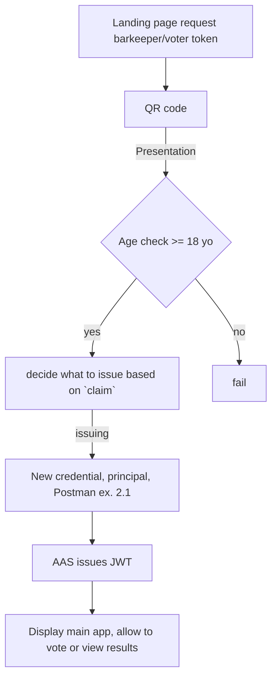

# User journey

- Preconditions: User has a SD
- User issues GXFS WSG -> Age 18+ -> Postman ex. 2.0
- Runtime: User landing page

```mermaid
graph TD
    A[Landing page request barkeeper/voter token] --> B[QR code]
    B --> |Presentation| C{Age check >= 18 yo}
    C --> |yes| H[decide what to issue based on `claim`]
    H --> |issuing| D[New credential, principal, Postman ex. 2.1]
    C --> |no| E[fail]
    D --> F[AAS issues JWT]
    F --> G[Display main app, allow to vote or view results]
```
